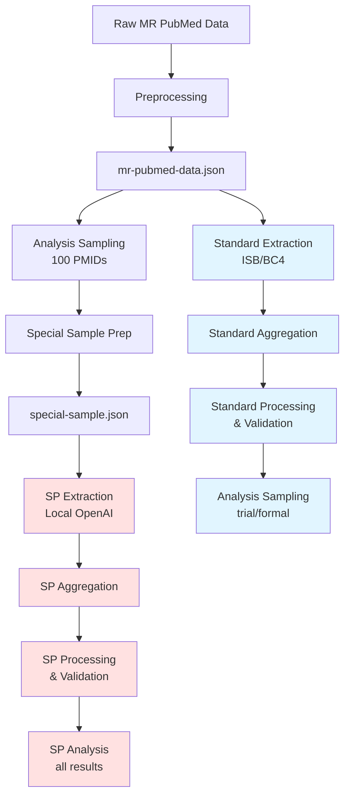
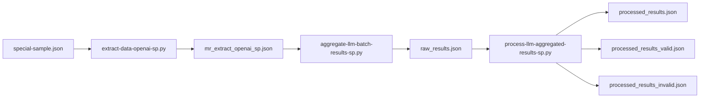
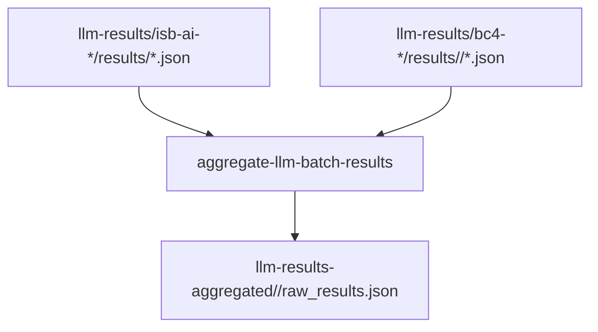
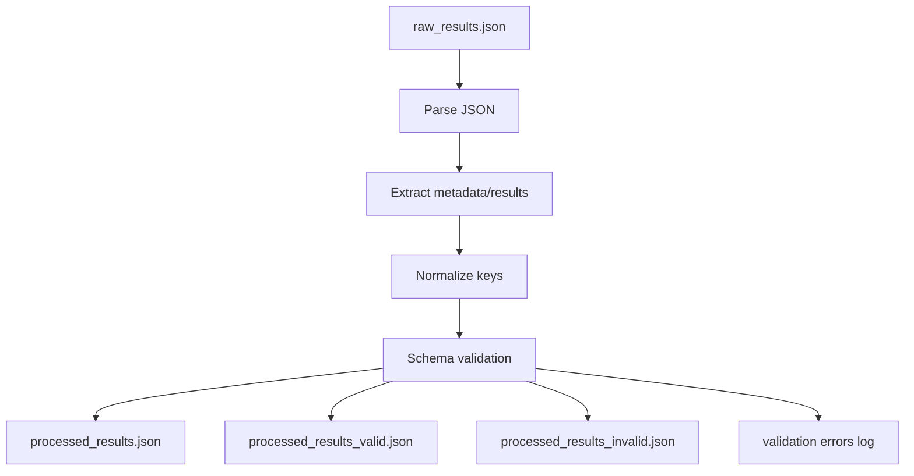

# Analysis steps

last updated: 2025-10-21

## Overview

This document describes the analysis workflow for LLM-based data extraction.
The workflow consists of three main phases:

1. Data preprocessing and preparation
2. Extraction processing (via local LLMs or OpenAI models)
3. Post-processing and analysis

Two parallel workflows exist:

1. Standard workflow: Full dataset with chunked processing
2. Special sample (SP) workflow: Targeted subset for detailed review



Legend:

- Blue: Standard workflow
- Red: Special sample (SP) workflow

______________________________________________________________________

## Data preprocessing / preparation

### Main preprocessing

Convert Gib's raw data into preprocessed data for extraction processing.

```bash
just -f justfile-processing data-prep-mr-pubmed
```

- Raw data: `data/raw/mr-pubmed-abstracts`
- Output: `data/intermediate/mr-pubmed-data`

Processing details:

- Generates `mr-pubmed-data.json` (full dataset)
- Generates `mr-pubmed-data-sample.json` (sample for pilots)
- Generates `mr-pubmed-data-sample-lite.json` (smaller sample for quick checks)
- Creates dated backups in `backups/` subdirectory

### Special sample preparation

Create a special sample for review analysis by filtering the full dataset to include only PMIDs from the formal analysis sample.

```bash
just -f justfile-processing prep-special-sample
```

- Input: `data/intermediate/analysis-sample/sample-42-100.json`
- Base data: `data/intermediate/mr-pubmed-data/mr-pubmed-data.json`
- Output: `data/intermediate/mr-pubmed-data/special-sample.json`

This special sample is used for targeted re-extraction with OpenAI models.

### Diagnostics (post-processing)

Notebook: `notebooks/analysis-data-prep/mr-data.ipynb`

______________________________________________________________________

## Extraction processing

### Initial exploration

Notebooks: `notebooks/models`

### Data extraction with local LLM (ISB Slurm)

Run on isambard-ai via Slurm job arrays. Use the batch justfile to submit jobs:

- LLaMA 3 (pilot):

  ```bash
  just -f justfile-batch isb-extract-data-llama3-pilot
  ```

- LLaMA 3 (full):

  ```bash
  just -f justfile-batch isb-extract-data-llama3
  ```

- LLaMA 3.2 (pilot):

  ```bash
  just -f justfile-batch isb-extract-data-llama3-2-pilot
  ```

- LLaMA 3.2 (full):

  ```bash
  just -f justfile-batch isb-extract-data-llama3-2
  ```

- DeepSeek-R1 (pilot):

  ```bash
  just -f justfile-batch isb-extract-data-ds-pilot
  ```

- DeepSeek-R1 (full):

  ```bash
  just -f justfile-batch isb-extract-data-ds
  ```

- DeepSeek Prover (pilot):

  ```bash
  just -f justfile-batch isb-extract-data-ds-prover-pilot
  ```

- DeepSeek Prover (full):

  ```bash
  just -f justfile-batch isb-extract-data-ds-prover
  ```

Output logic:

- Initial outputs: `output/isb-ai-{SLURM_ARRAY_JOB_ID}`
- Then moved to: `data/intermediate/llm-results/isb-ai-{SLURM_ARRAY_JOB_ID}`

### Data extraction with OpenAI models

#### Standard batch extraction (chunked processing)

Two ways to run:

1. Pilot runs (small sample, no Slurm):

   - o4-mini pilot:

     ```bash
     just -f justfile-batch openai-extract-data-o4-mini-pilot
     ```

   - gpt-4o pilot:

     ```bash
     just -f justfile-batch openai-extract-data-gpt-4o-pilot
     ```

   These write pilot outputs under: `data/intermediate/openai-batch-results/`

2. BC4 cluster (Slurm):

   - o4-mini (lite/full):

     ```bash
     just -f justfile-batch openai-extract-data-o4-mini-lite
     just -f justfile-batch openai-extract-data-o4-mini
     ```

   - gpt-4-1 (lite/full):

     ```bash
     just -f justfile-batch openai-extract-data-gpt-4-1
     just -f justfile-batch openai-extract-data-gpt-4-1-full
     ```

   - gpt-5 (lite/full):

     ```bash
     just -f justfile-batch openai-extract-data-gpt-5-lite
     just -f justfile-batch openai-extract-data-gpt-5-full
     ```

BC4 job outputs are organized under: `data/intermediate/llm-results/<BC4-JOB-ID>/results/<model>`

#### Special sample extraction (SP workflow)

The SP workflow processes the entire special sample in one go without chunking, using legacy prompts without schema in the extraction phase.

1. Pilot run (local, gpt-5-mini, 5 documents):

   ```bash
   just -f justfile-batch openai-sp-extract-pilot
   ```

2. Full batch run (local, all models):

   ```bash
   just -f justfile-batch openai-sp-extract-batch
   ```

   This processes the special sample with: gpt-5, gpt-5-mini, o4-mini, gpt-4o, gpt-4-1

Output structure:

- Script: `scripts/python/batch/extract-data-openai-sp.py`
- Input: `data/intermediate/mr-pubmed-data/special-sample.json`
- Output directory: `data/intermediate/openai-sp-batch-results/<model>/`
- Output file per model: `mr_extract_openai_sp.json` or `mr_extract_openai_sp_pilot.json`

Key differences from standard extraction:

- Processes all data in one go without chunking
- Uses legacy prompt templates (make_message_metadata, make_message_results)
- Does not use schema during extraction
- Stores both metadata and results completions in single JSON file

Processing flow:



______________________________________________________________________

## Post-processing

### Standard batch post-processing

#### Aggregate results

Aggregate model-specific batch raw results into aggregated raw results:

```bash
just -f justfile-processing aggregate-llm-batch-results
```

- Input: `data/intermediate/llm-results/<EXPERIMENT-ID>/results/*.json`
- Output: `data/intermediate/llm-results-aggregated/<MODEL-NAME>/raw_results.json`

Data flow:



#### Process and validate results

Process aggregated results (global + model-specific processing and schema validation):

```bash
just -f justfile-processing process-llm-batch-results
```

- Input: `data/intermediate/llm-results-aggregated/<MODEL-NAME>/raw_results.json`
- Output:
  - `data/intermediate/llm-results-aggregated/<MODEL-NAME>/processed_results.json`
  - `data/intermediate/llm-results-aggregated/<MODEL-NAME>/processed_results_valid.json`
  - `data/intermediate/llm-results-aggregated/<MODEL-NAME>/processed_results_invalid.json`
  - `data/intermediate/llm-results-aggregated/logs/<MODEL-NAME>_schema_validation_errors.log`

Processing steps:

1. Parse JSON from LLM completions
2. Extract and normalize metadata and results
3. Apply schema remapping for common key variations
4. Validate against JSON schemas
5. Split into valid and invalid subsets



### Special sample (SP) post-processing

#### Aggregate SP results

Aggregate OpenAI SP batch results:

```bash
just -f justfile-processing aggregate-llm-batch-results-sp
```

- Input: `data/intermediate/openai-sp-batch-results/<MODEL-NAME>/mr_extract_openai_sp.json`
- Output: `data/intermediate/llm-results-aggregated-sp/<MODEL-NAME>/raw_results.json`

Supported models: o4-mini, gpt-4o, gpt-4-1, gpt-5, gpt-5-mini

#### Process and validate SP results

Process and validate SP results:

```bash
just -f justfile-processing process-llm-batch-results-sp
```

- Input: `data/intermediate/llm-results-aggregated-sp/<MODEL-NAME>/raw_results.json`
- Output:
  - `data/intermediate/llm-results-aggregated-sp/<MODEL-NAME>/processed_results.json`
  - `data/intermediate/llm-results-aggregated-sp/<MODEL-NAME>/processed_results_valid.json`
  - `data/intermediate/llm-results-aggregated-sp/<MODEL-NAME>/processed_results_invalid.json`
  - `data/intermediate/llm-results-aggregated-sp/logs/<MODEL-NAME>_schema_validation_errors.log`

Processing steps:

1. Parse JSON from completion_metadata and completion_results fields
2. Process metadata (extract nested structures, remove metainformation)
3. Process results (extract nested structures, remap common key variations)
4. Validate against JSON schemas
5. Split into valid and invalid subsets

### Diagnostics

Optional diagnostic notebook

`notebooks/analysis-extraction/diagnostics-data-processing.ipynb`

______________________________________________________________________

## Analysis

### Standard analysis samples

Trial sample (size 20, seed 42):

```bash
just -f justfile-processing analysis-sample-trial
```

Formal sample (size 100, seed 42):

```bash
just -f justfile-processing analysis-sample-formal
```

Output:

- JSON: `data/intermediate/analysis-sample/sample-42-{20,100}.json`
- HTML: `data/intermediate/analysis-sample/sample-42-{20,100}.html`

These samples select PMIDs that are commonly available across all models and randomly sample from them, then produce both JSON and HTML renderings for review.

### Special sample (SP) analysis

Process all SP results without sampling:

```bash
just -f justfile-processing analysis-sample-sp
```

Output:

- JSON: `data/intermediate/analysis-sample-sp/all-results.json`
- HTML: `data/intermediate/analysis-sample-sp/all-results.html`

This aggregates all processed valid results from the SP workflow across available models for the special sample PMIDs.

Analysis data structure:

```json
[
  {
    "pubmed_data": {
      "pmid": "...",
      "ab": "...",
      ...
    },
    "model_results": {
      "o4-mini": {
        "pmid": "...",
        "metadata": {...},
        "results": [...]
      },
      "gpt-4o": {...},
      ...
    }
  }
]
```
