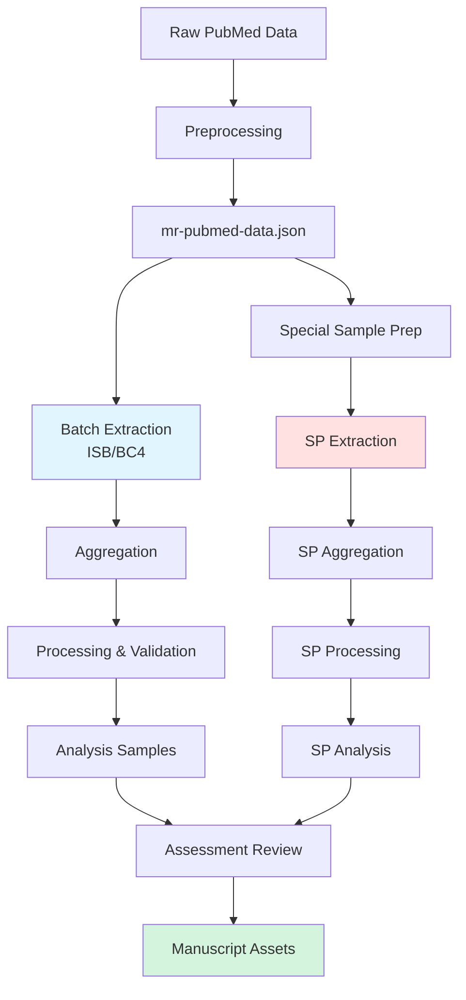

# Development

## Core principles

- Unless otherwise specified, run commands at the repo root, with the conda environment activated
- Use the task runner (just) to execute workflows rather than running scripts directly
- Follow the standard workflow: preprocessing -> extraction -> aggregation -> processing -> analysis

______________________________________________________________________

## Setting up

### 1. Clone repository

```bash
git clone <repository-url>
cd llm-data-extraction
git submodule update --init --recursive
```

### 2. Create conda environment

Choose the appropriate environment based on your compute resources:

- `data-extraction` (GPU, ISB cluster): `envs/environment.yml`
- `data-extraction-bp1` (GPU, BP1 cluster): `envs/environment-bp1.yml`
- `data-extraction-non-gpu` (CPU only): `envs/environment-non-gpu.yml`

```bash
# Example for standard GPU environment
conda env create -f envs/environment.yml
conda activate data-extraction
```

### 3. Install local packages

From the project root with conda environment activated:

```bash
python -m pip install -e src/local_funcs
python -m pip install -e src/yiutils
```

### 4. Configure environment variables

Create a `.env` file in the repo root with:

```bash
HUGGINGFACE_TOKEN=<your-token>      # Required for LLaMA models
PROJECT_OPENAI_API_KEY=<your-key>   # Required for OpenAI models
ACCOUNT_CODE=<hpc-account>          # Required for HPC job submission
```

### 5. Verify installation

```bash
just sanity
```

This command checks:
- Conda environment is active
- Local packages are installed
- Environment variables are set
- Python dependencies are available

______________________________________________________________________

## Project structure

```text
llm-data-extraction/
├── data/                    # Data files (see DATA.md)
│   ├── raw/                # Source data from external repositories
│   ├── intermediate/       # Processed data and LLM outputs
│   ├── artifacts/          # Manuscript-ready outputs
│   └── assets/             # Reference data and schemas
├── docs/                   # Additional documentation
├── envs/                   # Conda environment specifications
├── notebooks/              # Jupyter notebooks for exploration
├── scripts/                # Execution scripts
│   ├── python/            # Python scripts for workflows
│   │   ├── preprocessing/ # Data preparation
│   │   ├── batch/         # LLM extraction
│   │   ├── postprocessing/# Result aggregation and validation
│   │   └── analysis/      # Analysis and manuscript assets
│   ├── isb/               # ISB cluster job scripts
│   └── bc4/               # BC4 cluster job scripts
├── src/                    # Local packages
│   ├── local_funcs/       # Project-specific utilities
│   └── yiutils/           # General utilities (submodule)
├── justfile               # Task runner for development
├── justfile-batch         # Task runner for batch extraction
├── justfile-processing    # Task runner for data processing
└── pyproject.toml         # Project configuration
```

For detailed data organization, see DATA.md

______________________________________________________________________

## Task runners

The project uses `just` task runners to organize workflows:

### justfile (development and utilities)

Development commands and codebase maintenance:

```bash
just                    # List all available recipes
just sanity            # Health check
just format            # Format code with ruff
just ruff-check        # Lint code
just ty-check          # Type check
just test              # Run tests
```

### justfile-batch (data extraction)

Batch extraction workflows on HPC clusters:

```bash
just -f justfile-batch                           # List recipes
just -f justfile-batch isb-extract-data-llama3   # ISB cluster extraction
just -f justfile-batch openai-extract-data-o4-mini # BC4 OpenAI extraction
just -f justfile-batch openai-sp-extract-batch   # Special sample extraction
```

See ANALYSIS.md for detailed extraction workflow.

### justfile-processing (pre/post-processing)

Data preprocessing and post-processing:

```bash
just -f justfile-processing                         # List recipes
just -f justfile-processing data-prep-mr-pubmed     # Preprocess raw data
just -f justfile-processing aggregate-llm-batch-results  # Aggregate results
just -f justfile-processing process-llm-batch-results    # Validate and process
just -f justfile-processing analysis-sample-formal       # Generate analysis samples
```

See ANALYSIS.md for complete workflow details.

______________________________________________________________________

## Development tools

### Code formatting and linting

```bash
just format       # Auto-format with ruff
just ruff-check   # Lint and auto-fix issues
just ty-check     # Type checking with ty
```

### Testing

```bash
just test         # Run pytest suite
```

______________________________________________________________________

## HPC resources

### RDSF archive

Project data archive location:

```text
/projects/MRC-IEU/research/projects/ieu3/p3/015/working/data/llm-data-extraction
```

### Interactive development on ISB

Launch VS Code server on ISB cluster:

```bash
just vscode-isb          # Single GPU
just vscode-isb-2gpus    # Dual GPU
```

______________________________________________________________________

## Workflow overview



For detailed workflow steps, see ANALYSIS.md

______________________________________________________________________

## Related documentation

- DATA.md - Data organization and file structure
- ANALYSIS.md - Complete analysis workflow
- docs/manuscript-assets.md - Manuscript figures and tables generation

______________________________________________________________________
